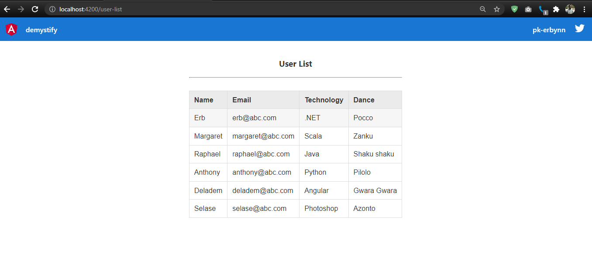

# Demystify

Demystify is a web-based application to demonstrate and demystify Angular unit testing.

**Screenshot:**



**File structure:**

<pre>
demystify
    |____ src/
    |       |___ app/
    |       |      |___components/
    |       |      |        |___ user-list/
    |       |      |                 |___ user-list.component.css
    |       |      |                 |___ user-list.component.html
    |       |      |                 |___ user-list.component.spec.ts
    |       |      |                 |___ user-list.component.ts
    |       |      |___interfaces/
    |       |      |        |___ user.ts
    |       |      |___services/
    |       |               |___ user.service.mocking-bird.spec.ts
    |       |               |___ user.service.spec.ts
    |       |               |___ user.service.ts
    |       |___ app-routing.module.ts
    |       |___ app.component.css
    |       |___ app.component.html
    |       |___ app.component.spec.ts
    |       |___ app.component.ts
    |       |___ app.module.ts
    |       |___ assets/
    |              |___ images/
    |___ package.json
    |___ README.md
    |___ ...
</pre>

This project was generated with [Angular CLI](https://github.com/angular/angular-cli) version 11.1.2.

## Technologies

* Karma
* Jasmine framework
* ts-mocking-bird library

## Usage

1. Clone this repository

```shell
$ git clone https://github.com/pkErbynn/demystify.git
```

2. Navigate to the root directory

```shell
$ cd /demystify
```

3. Run the following command to serve the application locally.

```shell
 $ ng serve --open
```

## Running unit tests

Run this command to execute the unit tests via [Karma](https://karma-runner.github.io).
```shell
$ ng test
```

**Service testing result (using [Jasmine](https://jasmine.github.io/pages/docs_home.html) & [ts-mocking-bird](http://opensource.morganstanley.com/ts-mocking-bird/)):**


**Component testing result (using [Jasmine](https://jasmine.github.io/pages/docs_home.html)):**


**All test result (from both service and component):**


Thank you :)
